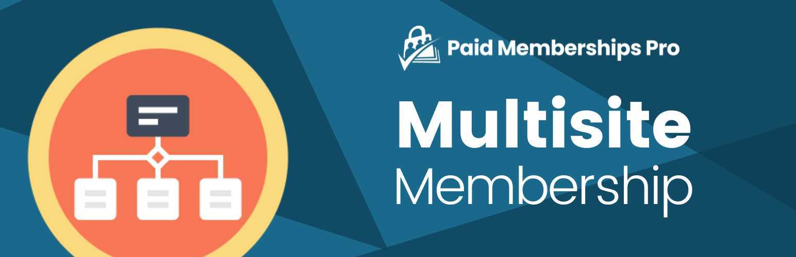

# [Paid Memberships Pro - Multisite Membership Add On](https://www.paidmembershipspro.com/add-ons/pmpro-network-membership/) #
[comment]: # (Generate badges from shields.io, only works for .org plugins to get other stats etc. We'd have to create our own endpoints for Premium plugins)

### Welcome to the Paid Memberships Pro - Multisite Membership Add On GitHub Repository
Centralize membership checkout, login, and admin on the main network site and restrict access to content across all of your subsites.

For more information please visit [paidmembershipspro.com/add-ons/pmpro-network-membership](https://www.paidmembershipspro.com/add-ons/pmpro-network-membership/)

## Installation ##
For detailed installation steps, visit the [documentation](https://www.paidmembershipspro.com/add-ons/pmpro-network-membership/) page.

1. Download the current development ZIP file directly: `https://github.com/strangerstudios/pmpro-network-subsite/archive/dev.zip`

**Please ensure that once installing this version of the plugin to remove `-dev` from the plugin's folder name.**

## Bugs ##
If you find an issue/bug, let us know by [creating a detailed GitHub issue](https://github.com/strangerstudios/pmpro-network-subsite/issues/new).

## Support ##
This is a developer's portal for Paid Memberships Pro - Multisite Membership Add On. We do not offer support on this channel. **Any support related questions should be directed to [paidmembershipspro.com/add-ons/pmpro-network-membership](https://www.paidmembershipspro.com/add-ons/pmpro-network-membership/).**

## Contributing to Paid Memberships Pro - Multisite Membership Add On ##
We encourage and welcome any contribution to Paid Memberships Pro - Multisite Membership Add On. Please read the [guidelines for contributing](https://github.com/strangerstudios/paid-memberships-pro/blob/dev/.github/CONTRIBUTING.md) to this repository.

There are various **ways to the help development** of Paid Memberships Pro - Multisite Membership Add On:

1. Report [bugs/issues](https://github.com/strangerstudios/pmpro-network-subsite/issues/new) on GitHub.
2. Work on any issues by submitting a Pull Request.

Here are some ways for **non-developers to contribute** to Paid Memberships Pro - Multisite Membership Add On:

1. Translate Paid Memberships Pro - Multisite Membership Add On into your own [language](https://www.paidmembershipspro.com/paid-memberships-pro-in-your-language/).
2. [Purchase a paid membership](https://paidmembershipspro.com/pricing) to help fund ongoing development and bug fixes.